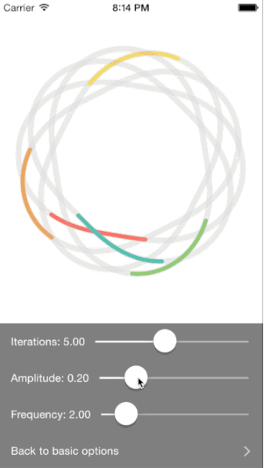

##LogoFunhouse Overview

The logo for [Simple](http://www.simple.com) can be generated algorithmically. Specifically, the shape can be influenced by providing 

- `iterations`
- `amplitude`
- `frequency`

The shape also needs to have a specified `resolution` that effects the precision of the shape more than the actual shape itself. The main reusable piece here is `SFSimpleLogoAnimationView`, a `UIView` subclass that allows for configuration of the logo's shape, and the logo's aesthetic presentation. 

The logo is also animatable. Specifically the length of the stroke of each line can be configured via `tailLength` (between 0 and 1). Along side that a duration can be set via `setDuration:` that will have the stroke chase itself making a full rotation every `duration`. An array of `colors` can be set to be the colors of each line. You can also `setRandomizeDuration:` which will offset the duration of each line by some small amount so there is some variability in the pace of the animation. 

Below are a couple example of the results you can get by tweaking these parameters.

